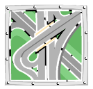

## Exercise Requirements
1. Object technology is …?
   * A. A set of principles guiding software construction.
   * B. A new theory striving to gain acceptance
   * C. A dynamic new language by Grady Booch.
   * D. Based on the principles of abstraction and modularity.

2. A model is …?
   * A. Is not necessary when team members understand their job.
   * B. Has to be structural AND behavioral.
   * C. Is a simplification of reality.
   * D. Is an excuse for building an elaborate plan.

3. Why do we model?
   * A. Helps to visualize a system.
   * B. Gives us a template for constructing a system.
   * C. Documents our decisions.
   * D. All of the above.

4. The best models are connected to …?
   * A. Java-script code.
   * B. Reality.
   * C. C++.
   * D. Issues that tie it to an object-oriented developer.

5. Which project would be least likely to require a model?
   * A.  &emsp;&emsp; B. 
   * C.  &emsp;&emsp;&emsp; D. 

6. Which principles of modeling are correct?
   * A. The model you create, influences how the problem is attacked.
   * B. The best kinds of models are those that let your chose your degree of details.
   * C. The best models are connected to reality.
   * D. Create models that are bult and studied separately.

7. Which process characteristic is not essential to working with the UML?
   * A. Iterative and incremental.
   * B. Use-case driven.
   * C. Resilient.
   * D. Architecture-centric.

8. The state of an object …?
   * A. Is defined by a “state”attribute or set of attributes.
   * B. Does not normally change over time.
   * C. Is defined by an object’s attributes and relationships.
   * D. Is the only condition in which an object may exist.

9. The visible behavior of an object is modeled by its …?
   * A. Attributes.
   * B. Responsibilities.
   * C. Operations.
   * D. Methods.

10. Encapsulation …?
    * A. Allows direct manipulation of things that have been encapsulated.
    * B. Is often referred to as information hiding.
    * C. Causes costly and extensive maintenance.
    * D. Causes changes to affect clients during implementation.

11. What happens when you incorporate modularity into you plan?
    * A. It reduces something complex into manageable pieces.
    * B. It builds modules that talk to each other.
    * C. Creates systems too large to understand.
    * D. Parts of your system cannot be independently developed.

12. A class ...?
    * A. Is an encapsulation of an object.
    * B. Represents the hierarchy of an object.
    * C. Is an instance of an object.
    * D. Is an abstract definition of an object.

13. Polymorphism can be described as ?
    * A. Hiding many different implementations behind one interface.
    * B. Inheritance.
    * C. Information placing.
    * D. Generalization

14. What phrase best represents a generalization relationship?
    * A. Is a part of.
    * B. Is a kind of.
    * C. Is a replica of.
    * D. Is an inheritance of

15. Which of the following would you use to organize elements into groups?
    * A. Package.
    * B. Class.
    * C. Encapsulation.
    * D. Generalization.